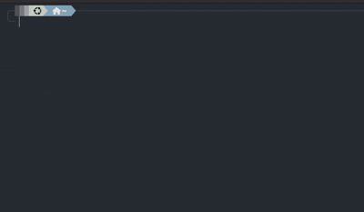

# Go-Grab: Universal CLI Media Downloader 🚀

**Go-Grab** is a high-performance **TUI (Text User Interface)** wrapper for `yt-dlp`, built in **Go**. It replaces complex CLI flags with a beautiful, menu-driven interface to download media from **YouTube, Instagram, X (Twitter), Reddit, and 1000+ other sites**.



## ✨ Features

-   **🎨 Modern TUI**: Built with [Bubble Tea](https://github.com/charmbracelet/bubbletea) and [Lipgloss](https://github.com/charmbracelet/lipgloss) for a stunning, colorful interface.
-   **📊 Smart Metadata**: Automatically fetches and displays video **Title**, **Uploader**, and **Duration** *before* you download.
-   **🎬 Quality Selection**: Choose your preferred quality:
    -   **Best Quality (MP4)**
    -   **1080p (MP4)**
    -   **720p (MP4)**
    -   **Audio Only (MP3)**
-   **📈 Detailed Progress**: See **Real-time Download Speed**, **ETA**, and **Total File Size** while you wait.
-   **⚡ Non-Blocking**: Uses Go's concurrency to keep the UI responsive while downloading.
-   **🌍 Universal Support**: Works with any site supported by `yt-dlp`.

---

## 🛠 Prerequisites

You **must** have `yt-dlp` installed for Go-Grab to work.

### Recommended: Install `yt-dlp`
Follow the official instructions [here](https://github.com/yt-dlp/yt-dlp#installation), or use a package manager:

```bash
# MacOS
brew install yt-dlp ffmpeg

# Linux (Debian/Ubuntu)
sudo apt install yt-dlp ffmpeg

# Windows (Winget)
winget install yt-dlp
```

> **Note:** If you are installing `go-grab` globally using `go install`, you might need to copy the `yt-dlp` binary to your `go/bin` folder if it's not in your system PATH.

---

## 📦 Installation

### Method 1: Install Globally (Recommended)

Run this command from inside the downloaded project folder:

```bash
go install .
```

This will compile the binary and place it in your `$GOPATH/bin` (usually `~/go/bin`). You can then run `go-grab` from anywhere in your terminal.

**Important:** Ensure `yt-dlp` is accessible. Go-Grab looks for `yt-dlp` in the following order:
1.  Next to the `go-grab` executable.
2.  In the current working directory.
3.  In your system `$PATH`.

### Method 2: Run from Source

Clone the repo and run directly:

```bash
git clone https://github.com/rohitkshirsagar19/go-grab.git
cd go-grab
go run main.go
```

---

## 🏗 Under the Hood

-   **Architecture**: Event-driven [ELM Architecture](https://guide.elm-lang.org/architecture/) via Bubble Tea.
-   **Concurrency**: Spawns `yt-dlp` as a subprocess; streams output via **Pipes** and **Channels** to update the UI without freezing.
-   **Parsing**: Real-time Regex parsing of `yt-dlp`'s raw output to drive the progress bar and stats.

---

*Created by [Rohit Kshirsagar](https://github.com/rohitkshirsagar19)*